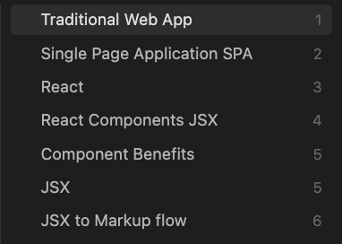

## Description

Simple CLI tool for parsing PDF files from Boox with the hidden text layer.

As a dedicated user of writing handwritten notes on my boox conflicted by my love of Obsidian this is a nice middle ground where I can have both.

## Dependencies for installing

```
brew install ocrmypdf tesseract poppler ghostscript
```

## Installation

```
chmod +x cli.js
npm link           # from the project folder
which bm-ocr       # confirm it points to this folder
```

## CLI Usage

```
bm-ocr "PDF from AI Boox as Bitmap.pdf"
```

## Additional Notes

To get search power in Obsidian with handwritten notes, I have installed the following plugins to support OCR recognition:

- Omnisearch
- TextExtractor

The processed PDFs are just presented within a Obsidian md note with the embedded PDF viewer.

e.g.

```
![[PDF from AI Boox as Bitmap.pdf]]
```

The benefit here is you get your original handwritten notes but with hidden search extracted OCR text behind it which you can search using omnisearch.

> ✅ Tip
>
> Using 'Outlines' in your Boox Notes gives a nice clean Table of contents as a backup to search also when you export.
>
> The Obsidian PDF viewer shows this menu options:


